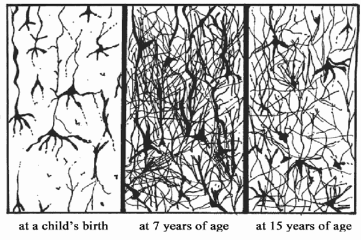
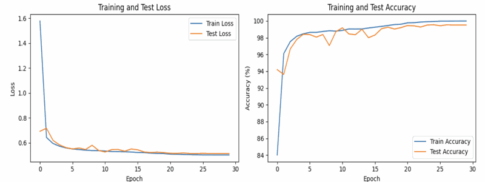
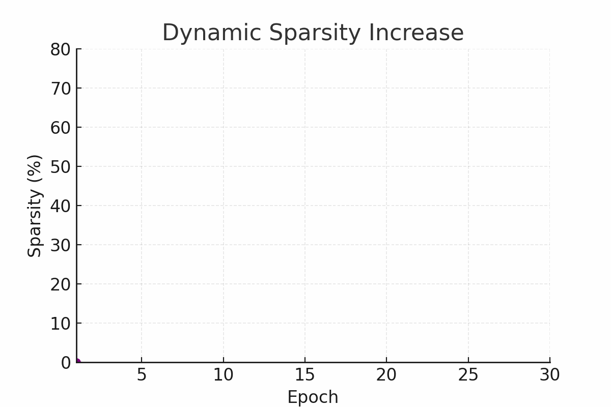

# 🎯 Dynamic Pruning for Neural Network Lottery Tickets

Efficiently identify sparse sub-networks—**winning tickets**—within a **single training cycle** by dynamically pruning weights during training.

[](https://www.python.org/)
[](https://pytorch.org/)


---

## 🧠 Biological Inspiration

<p align="center">
  
  <p><i>Synaptic pruning from childhood to adolescence inspires dynamic sparsity.</i></p>
</p>

The human brain undergoes synaptogenesis (creating many connections) followed by synaptic pruning (eliminating redundant ones) as it matures. Inspired by this, our dynamic pruning approach progressively removes less important neural connections during training, retaining only critical pathways.

---

## 🌟 Overview

The **Lottery Ticket Hypothesis (LTH)** posits that dense neural networks contain sparse subnetworks ("winning tickets") capable of matching the original network's performance when trained from scratch. However, conventional LTH methods face a significant challenge: they require computationally expensive cycles of:

1. Training a dense network to convergence
2. Pruning low-magnitude weights 
3. Rewinding remaining weights to their initial values
4. Retraining the sparse network from scratch
5. Repeating multiple times to find optimal tickets

Our approach revolutionizes this paradigm with a **dynamic pruning methodology** that operates within a single training cycle. Instead of the train-prune-retrain loop, we progressively mask weights during training based on their magnitude, allowing the network to naturally adapt to increasing sparsity levels.

This novel approach offers remarkable efficiency benefits:
- **Significant reduction in computational overhead**
- **Elimination of retraining cycles**
- **Competitive or superior accuracy** compared to traditional LTH methods
- **Biologically plausible** alignment with neural development

---

## 🚀 Highlights

- 🔄 **Dynamic Sparsity:** Gradually masks low-magnitude weights during training (0% → 80% sparsity).
- 📉 **Single Training Cycle:** Integrates pruning directly into training, eliminating retraining.
- 📊 **High Accuracy at High Sparsity:** Maintains high accuracy (up to 94.91% on CIFAR-10, 99.51% on MNIST).
- 🧠 **Inspired by Neuroscience:** Mimics natural synaptic pruning processes in the brain.

---

## 📊 Results Summary

| Dataset   | Final Sparsity | Test Accuracy         | Epochs | Parameter Reduction |
|-----------|----------------|-----------------------|--------|---------------------|
| CIFAR-10  | 80%            | 91.98% – 94.91%       | 200    | 11.2M → 2.2M (5×)   |
| MNIST     | 77%            | 99.45% – 99.51%       | 30     | 11.2M → 2.6M (4.3×) |

<p align="center">
  
  <p><i>Train vs. Test accuracy and loss during training (MNIST).</i></p>
</p>

<p align="center">
  
  <p><i>Sparsity progression across epochs (MNIST).</i></p>
</p>

---

## 🧪 Detailed Methodology

Our dynamic pruning method progressively identifies and removes less important neural connections during a single training cycle. Here's the clear workflow:

- **Initialization:**  
  Begin with fully active weights W and binary mask M = 1 (no pruning initially).

- **Dynamic Sparsity Schedule:**  
  Increase sparsity linearly from 0% (fully dense) to the target sparsity (e.g., 80%) across training epochs.  
  Compute sparsity level at epoch e:
  ```
  S_e = min(S_final, ΔS × e)
  ```

- **Threshold-based Masking:**  
  Calculate pruning threshold θ at the S_e-percentile of absolute weights |W|.  
  Update binary supermask M:
  ```
  M_ij = 0  if |W_ij| < θ
  M_ij = 1  otherwise
  ```

- **Training with Pruning:**  
  During forward and backward propagation, apply the mask:
  ```
  output = model(input; W ⊙ M)
  ```
  where ⊙ represents element-wise multiplication.

- **Iterative Update:**  
  Repeat the mask update and training for each epoch, allowing the network to dynamically adapt to the evolving sparsity.

<p align="center">
  
  <p><i>Flowchart illustrating the dynamic pruning algorithm.</i></p>
</p>

---

## 📂 Project Structure

```
📁 dynamic-lottery-tickets/
├── biological_pruning.gif
├── accuracy_loss_progression.gif
├── dynamic_sparsity.gif
├── diagram-2.png
├── datasets.md
├── README.md
├── requirements.txt
├── main.py
├── CIFAR10_With_Validation.ipynb
├── CIFAR10_Without_ValidationSet.ipynb
├── MNIST_with_Validation.ipynb
├── MNIST_without_ValidationSet.ipynb
├── Experiment_Cifar10_BatchSize_32.ipynb
├── Experiment_Cifar10_LR_0.001.ipynb
├── Experiment_Cifar10_LR_0.01.ipynb
├── Experiment_MNIST_BS_32.ipynb
├── Experiment_MNIST_LR_0.001.ipynb
├── Experiment_MNIST_momentum0.5.ipynb
├── Experiment_Cifar10_Epoch30_BS32.ipynb
├── Experiment_Cifar10_Epoch400_BS128.ipynb
├── Experiment_MNIST_with_Epoch100.ipynb
└── Experiment_Cifar10_Resnet34.ipynb
```

---

## 🚀 Quickstart

```bash
git clone https://github.com/romanaq/dynamic-lottery-tickets.git
cd dynamic-lottery-tickets
pip install -r requirements.txt

# Train CIFAR-10
python main.py --dataset cifar10 --epochs 200 --batch-size 128 --final-sparsity 0.8

# Train MNIST
python main.py --dataset mnist --epochs 30 --batch-size 32 --final-sparsity 0.77
```

---

## 🔭 Future Work
- Scaling to larger models (ResNet-50, Transformers).
- Advanced pruning criteria (gradient-based).
- Hardware integration for edge computing.
- Adaptive sparsity schedules.

---

## 👤 Author

**Romana Qureshi**  
*Master of Science in Artificial Intelligence, King Saud University*  
Researcher in Sparse Deep Learning

---

## 📬 Contact

For questions or collaboration, contact me on [GitHub](https://github.com/romanaq).

---

## ⚡ Technologies


---

<p align="center">
  <i>Inspired by nature. Built for efficiency.</i>
</p>
